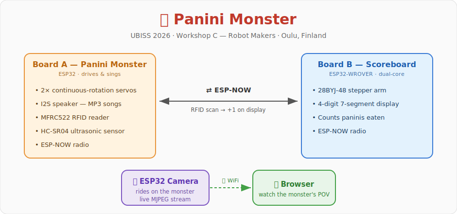

# 🥪 Panini Monster

<p align="center">
  
</p>

> **Team:** Nielsen Cugito · Madden Rota

Final project for **[UBISS 2026](https://ubicomp.oulu.fi/UBISS2026)** — the 14th International UBI Summer School, held in Oulu, Finland, June 8–13, 2026.

We took part in **Workshop C: *Robot Makers — Expression Through Robotics***, led by Assoc. Prof. Ankur Mehta (UCLA) and Assoc. Prof. Cynthia Sung (UPenn). The workshop explores robotics as an artistic and engineering medium — using mechanical design, fabrication, and code to build functional robots that express a creative idea.

Our "Panini Monster" is a roaming robot that trundles around singing the *panini* song, gets startled by obstacles, and "eats" paninis presented to it as RFID tags. A companion board keeps score on a 7‑segment display and waves a stepper-driven arm, while an ESP32 camera streams the monster's first-person view. The two robot brains talk to each other wirelessly over ESP‑NOW.

---

## Repository contents

| Path | What it is |
|------|------------|
| [sender/sender_v2.ino](sender/sender_v2.ino) | **Board A** — the Panini Monster itself: motors, audio, RFID, ultrasonic sensor |
| [sender/data/](sender/data/) | MP3 clips uploaded to the ESP32 flash (LittleFS): `panini`, `delicious`, `classic_hurt`, `ending` |
| [receiver/receiver.ino](receiver/receiver.ino) | **Board B** — companion scoreboard: stepper arm + 4‑digit 7‑segment counter |
| [CameraWebServer/](CameraWebServer/) | ESP32 camera that streams the monster's live video over WiFi |
| [panini_demo_v1.mp4](panini_demo_v1.mp4) | Demo video of the full robot in action |
| [speaker_and_rfid.mp4](speaker_and_rfid.mp4) | Demo video of the audio + RFID subsystem |
| [Panini_Monster_Final.pdf](Panini_Monster_Final.pdf) | Slides from the final presentation |

---

## The three sketches

### 1. `sender/sender_v2.ino` — the Panini Monster (Board A)

A standard ESP32 dev board that drives the robot and produces all the sound. It runs a small state machine:

| State | Behaviour |
|-------|-----------|
| **PANINI** *(default)* | Drives forward and loops `panini.mp3` endlessly. The clip gets a little louder each time it restarts. |
| **OBSTACLE** | When the HC‑SR04 ultrasonic sensor sees something within **10 cm**, the robot spins in place for a random 0.5–2 s while playing `classic_hurt.mp3`, then resumes forward + panini. |
| **HURT** | Each RFID tag ("panini") scanned plays `delicious.mp3` once, then returns to PANINI. Every scan increments a counter and is broadcast to Board B. |
| **ENDING** | After enough scans (see note below) the robot stops driving and plays `ending.mp3` once, all the way through. |
| **DONE** | Motors off, audio off, radio quiet — the monster is full and rests. |

Key design choices baked into the code:
- **No `delay()` in `loop()`** — the MP3 decoder must be fed every iteration, so all timing uses `millis()` deadlines. The ultrasonic ping uses a deliberately short echo timeout so it never stalls the audio.
- Audio plays from **LittleFS** via the ESP8266Audio library (`AudioGeneratorMP3` → `AudioOutputI2S`).
- Sends an **ESP‑NOW** heartbeat every 2 s and fires event messages on obstacle/scan.

> ⚠️ **Note on the finale trigger:** the header comments talk about "more than 3 scans / the 4th scan," but the active constant is `MAX_RFID_SCANS = 2`, so the finale actually fires on the **3rd** scan (`rfidScanCount > 2`). The comments are stale; the code is the source of truth.

### 2. `receiver/receiver.ino` — the scoreboard (Board B)

An **ESP32‑WROVER** that acts as the monster's "stomach counter," using both cores:
- **Core 1 (`loop`)** drives a 28BYJ‑48 **stepper motor** (via a ULN2003 driver) back and forth a quarter turn — a waving arm — while the panini count is below 3.
- **Core 0 (display task)** continuously multiplexes a **4‑digit 7‑segment display** to show the current count.
- **ESP‑NOW:** every time Board A reports an RFID scan (`id == 1`), this board increments `displayValue` and shows it. It also sends a heartbeat carrying its current value.

### 3. `CameraWebServer/` — the live camera feed

The stock Espressif **CameraWebServer** example, configured for the **`CAMERA_MODEL_WROVER_KIT`** board ([board_config.h](CameraWebServer/board_config.h)). On boot it connects to WiFi (SSID `coldspot`) and serves a web UI with a live MJPEG stream and the usual camera controls:

```
http://<device-ip>/         web UI
http://<device-ip>/stream   live MJPEG video
http://<device-ip>/capture  single still
http://<device-ip>/control  sensor settings (resolution, quality, …)
```

This gives spectators a first-person view from the monster while it roams.

---

## Wiring diagrams

Pin assignments below are read directly from the source — no guessing. WiFi/ESP‑NOW uses no GPIOs, so there are no conflicts with the wired peripherals.

### Board A — Panini Monster (`sender_v2.ino`)

```
                          ESP32 (Board A)
                       ┌───────────────────┐
   I2S audio amp       │                   │      HC-SR04 ultrasonic
  (e.g. MAX98357A)     │                   │
     BCLK ─────────────┤ GPIO15     GPIO33 ├──────── TRIG
      LRC ─────────────┤ GPIO2      GPIO32 ├──────── ECHO  (via 5V→3.3V
     DIN  ─────────────┤ GPIO27            │          voltage divider!)
     VIN  ── 5V         │                   │
     GND  ── GND        │                   │
                        │                   │      Continuous-rotation servos
   MFRC522 RFID (SPI)   │                   │
      SCK ─────────────┤ GPIO18     GPIO26 ├──────── Servo 1 (signal)  → left wheel
     MISO ─────────────┤ GPIO19     GPIO25 ├──────── Servo 2 (signal)  → right wheel
     MOSI ─────────────┤ GPIO23            │         (servo V+ → 5V, GND → GND)
   SDA/SS ─────────────┤ GPIO5             │
      RST ── (unused; tie to 3V3)          │
      3V3 ── 3V3        │                   │
      GND ── GND        └───────────────────┘
```

| Peripheral | Signal | ESP32 GPIO |
|-----------|--------|-----------|
| I2S audio amp | BCLK / LRC / DIN | 15 / 2 / 27 |
| MFRC522 RFID (SPI) | SCK / MISO / MOSI / SS | 18 / 19 / 23 / 5 |
| Drive servos | Servo 1 / Servo 2 (signal) | 26 / 25 |
| HC‑SR04 ultrasonic | TRIG / ECHO | 33 / 32 |

> The HC‑SR04 ECHO line is 5 V — feed it through a divider (or level shifter) before GPIO32. Servos and the audio amp draw real current; power them from a dedicated 5 V rail with a common ground, not the ESP32's regulator.

### Board B — Scoreboard (`receiver.ino`)

```
                     ESP32-WROVER (Board B)
                    ┌────────────────────────┐
  28BYJ-48 stepper  │                        │   4-digit 7-segment display
   via ULN2003      │                        │
     IN1 ───────────┤ GPIO13          GPIO4  ├──── seg a
     IN2 ───────────┤ GPIO14          GPIO5  ├──── seg b
     IN3 ───────────┤ GPIO27          GPIO18 ├──── seg c
     IN4 ───────────┤ GPIO26          GPIO19 ├──── seg d
   (V+ → 5V, GND)   │                 GPIO21 ├──── seg e
                    │                 GPIO22 ├──── seg f
   digit commons    │                 GPIO23 ├──── seg g
     D1 ────────────┤ GPIO2           GPIO25 ├──── seg DP
     D2 ────────────┤ GPIO32                 │
     D3 ────────────┤ GPIO33                 │
     D4 ────────────┤ GPIO15                 │
                    └────────────────────────┘
```

| Peripheral | Signal | ESP32 GPIO |
|-----------|--------|-----------|
| 28BYJ‑48 stepper (ULN2003) | IN1 / IN2 / IN3 / IN4 | 13 / 14 / 27 / 26 |
| 7‑seg digit commons | D1 / D2 / D3 / D4 | 2 / 32 / 33 / 15 |
| 7‑seg segments | a / b / c / d / e / f / g / DP | 4 / 5 / 18 / 19 / 21 / 22 / 23 / 25 |

### Camera (`CameraWebServer`)

Uses the fixed DVP camera interface of the **ESP32‑WROVER‑KIT** module ([camera_pins.h](CameraWebServer/camera_pins.h#L2-L19)). These are the on-board camera connector pins — nothing to wire by hand if you use a WROVER‑KIT:

| Function | GPIO | Function | GPIO |
|----------|------|----------|------|
| XCLK | 21 | VSYNC | 25 |
| SIOD (SDA) | 26 | HREF | 23 |
| SIOC (SCL) | 27 | PCLK | 22 |
| D0–D7 (Y2–Y9) | 4, 5, 18, 19, 36, 39, 34, 35 | PWDN / RESET | not used (−1) |

---

## ESP‑NOW link between Board A and Board B

Both robot boards run a tiny shared message protocol over ESP‑NOW (peer-to-peer WiFi, no router needed):

```c
typedef struct {
  int   id;       // 0 = heartbeat, 1 = RFID scan, 2 = obstacle
  float value;    // scan count / spin time / heartbeat counter
  char  text[16]; // human-readable label
} Message;
```

- One board is flagged `#define BOARD_A true`, the other `false`. Each sketch has both boards' MAC addresses hard-coded and talks to its peer.
- **Board A → Board B:** sends `id = 1` ("rfid") on every panini scan. Board B increments its display counter in response.
- Heartbeats (`id = 0`) flow both ways every 2 s.

> To reproduce on your own hardware you must replace `macOfA` / `macOfB` with your boards' real STA MAC addresses, and set `BOARD_A` appropriately on each.

---

## Building & flashing

All three sketches are built with the **Arduino IDE** + the **ESP32 board package (arduino‑esp32 3.x)**.

**Libraries used:**
- `sender_v2.ino`: [ESP8266Audio](https://github.com/earlephilhower/ESP8266Audio) (`AudioGeneratorMP3`, `AudioOutputI2S`, `AudioFileSourceLittleFS`), [MFRC522v2](https://github.com/OSSLibraries/Arduino_MFRC522v2), [ESP32Servo](https://github.com/madhephaestus/ESP32Servo), plus the built-in `LittleFS`, `WiFi`, `esp_now`.
- `receiver.ino`: built-in `Stepper`, `WiFi`, `esp_now`.
- `CameraWebServer`: the `esp_camera` library bundled with the ESP32 core.

**Uploading the audio (Board A):** the MP3s in [sender/data/](sender/data/) must be flashed to the ESP32's **LittleFS** partition (e.g. with the *Arduino LittleFS Upload* plugin / `arduino-littlefs-upload`) so the sketch can find `/panini.mp3`, `/delicious.mp3`, `/classic_hurt.mp3`, and `/ending.mp3`. Choose a partition scheme with a SPIFFS/LittleFS region.

**Camera:** the partition scheme should provide ≥3 MB app space; see the warning in [board_config.h](CameraWebServer/board_config.h) and the included [partitions.csv](CameraWebServer/partitions.csv). Set your WiFi SSID/password near the top of [CameraWebServer.ino](CameraWebServer/CameraWebServer.ino#L13-L14).

---

## Demo & slides

- 🎬 [panini_demo_v1.mp4](panini_demo_v1.mp4) — the assembled Panini Monster in action.
- 🔊 [speaker_and_rfid.mp4](speaker_and_rfid.mp4) — close-up of the audio + RFID "eating" interaction.
- 🖼️ [Panini_Monster_Final.pdf](Panini_Monster_Final.pdf) — the final presentation deck.

---

*Built by **Nielsen Cugito** & **Madden Rota** at UBISS 2026, Workshop C — RoboMakers, University of Oulu.*

Sources for the summer-school context: [UBISS 2026](https://ubicomp.oulu.fi/UBISS2026) · [UBISS 2026 schedule](https://ubicomp.oulu.fi/UBISS2026/schedule)
